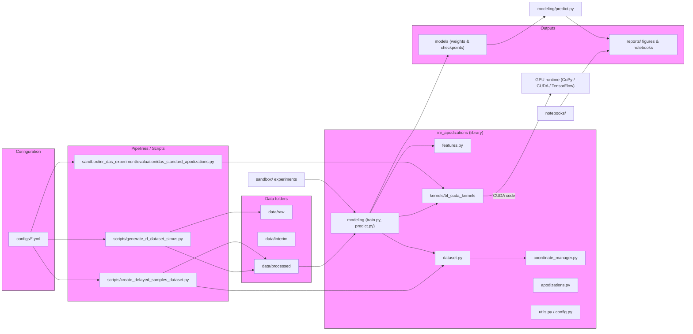

# Architecture diagram

Below is a high-level architecture diagram of the INR-Apodizations project. Open this file in VS Code and use Markdown Preview (Ctrl+Shift+V) or a Mermaid preview extension to render the diagram.

Notes
- To render Mermaid inside VS Code, you can install the "Markdown Preview Mermaid Support" extension or open the built-in Markdown preview.
- If you prefer, I can also export this diagram as a PNG/SVG and add it to `docs/figures/`.
